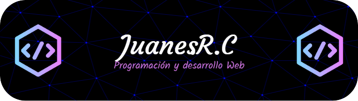

  
  <h1>Bienvenid@ al Github de Juanesrc</h1>

  

  

  

  

  

  

  

  

  Soy una persona apasionada por la tecnología, siempre en busca de nuevas oportunidades para aprender y crecer. Me gusta lanzar proyectos experimentales que me permiten probar las últimas tecnologías, lo que me ayuda a mantenerme actualizado y mejorar mis habilidades de manera constante. Al enfrentar nuevos retos profesionales, me esfuerzo por mejorar en cada paso, siendo disciplinado y comprometido con mi desarrollo. Mi experiencia en proyectos colaborativos ha potenciado mis habilidades de liderazgo y comunicación, preparándome para trabajar de manera eficaz en entornos multidisciplinarios y dinámicos, adaptándome a las demandas cambiantes del sector tecnológico

  
    

  <h1>Tecnologías💻 </h1>

  

  
  
  
  
  
    
  
  
  
  
  

<!--
**Juanesrc967/Juanesrc967** is a ✨ _special_ ✨ repository because its `README.md` (this file) appears on your GitHub profile.

Here are some ideas to get you started:

- 🔭 I’m currently working on ...
- 🌱 Estudiante en tecnologo en sistemas ...
- 👯 I’m looking to collaborate on ...
- 🤔 I’m looking for help with ...
- 💬 Ask me about ...
- 📫 How to reach me: ...
- 😄 Pronouns: ...
- ⚡ Fun fact: ...
-->

